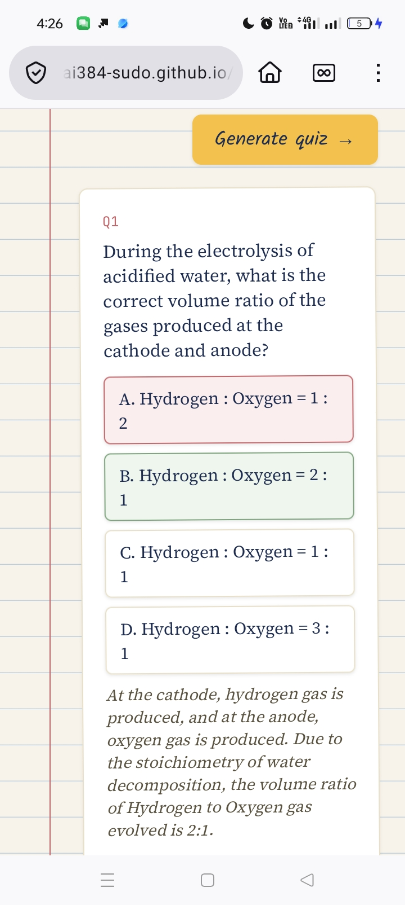
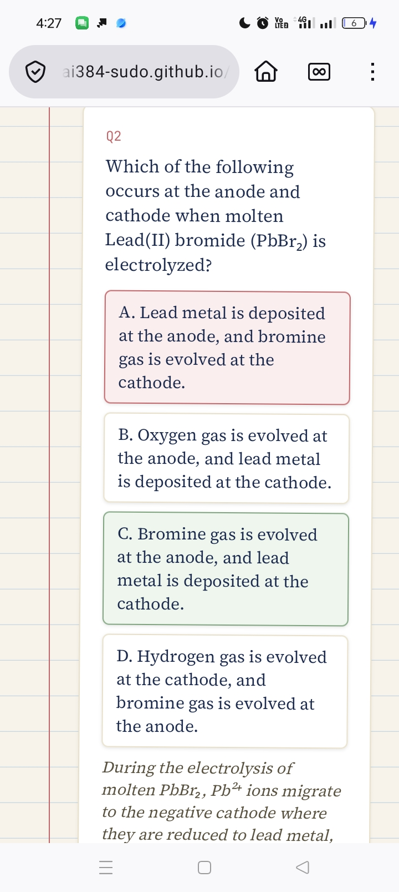
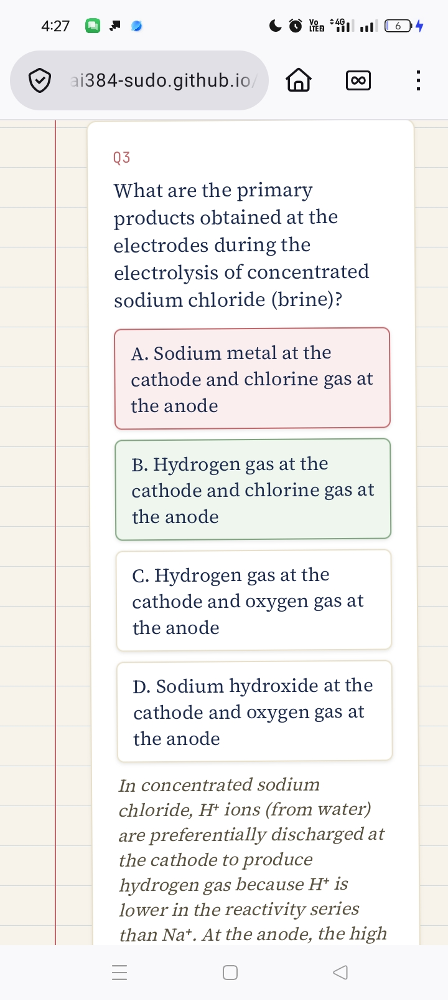
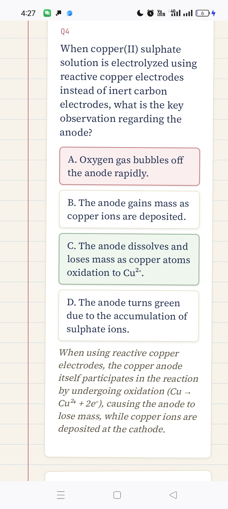
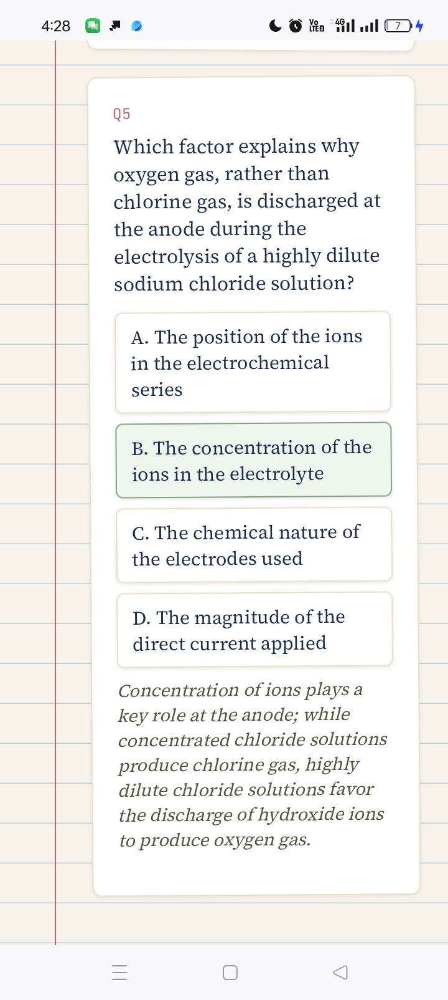

# Quiz Me On This — AI Study Quiz Generator

A lightweight web app that turns any set of study notes or a topic into a multiple-choice practice quiz with explanations, built to support peer tutoring.

**Live demo:** https://carenchemutai384-sudo.github.io/ai-quiz-generator-/

## Why I built this

I've spent four years as a peer tutor in Biology, Chemistry, and English. This project applies that experience to test whether AI-generated questions can actually teach, not just generate content that looks like a quiz.

## Features

- Paste any notes or topic, choose subject, difficulty, and number of questions
- Instant multiple-choice quiz with answer feedback and explanations
- Score tracking and a persistent "history" of past quiz sessions (saved locally in your browser)
- A running "questions you've missed" list, aggregated across sessions, to surface weak spots

## What I learned testing it

I tested this across multiple KLB Form Four topics in both Chemistry (Organic Chemistry, Electrolysis, Salts, Water Hardness, Radioactivity) and Mathematics (Matrices, Vectors, Probability, Linear Programming, Calculus).

A clear pattern emerged: the AI's flawed distractors were almost always technically-defensible-but-imprecise wording (e.g., "combustion only" or "distillation only") rather than outright factual errors, and this problem showed up far more in Chemistry than in Mathematics, where answers are numeric and less open to interpretation. This taught me that building useful AI tools for education requires encoding the judgment a real tutor develops over years of watching where students actually get confused, not just prompting a model to "write quiz questions."

## Tech

- Vanilla HTML/CSS/JavaScript — no build step, no framework dependencies
- Calls the Google Gemini API directly from the browser (user supplies their own free API key, stored only in that browser session)
- Uses `localStorage` for persistent quiz history

## Running it yourself

1. Clone this repo or download `index.html`
2. Open it in any browser, or host it via GitHub Pages
3. Get a free API key at [aistudio.google.com/apikey](https://aistudio.google.com/apikey) — no credit card required
4. Paste your key into the app and start generating quizzes

## Screenshots

**Q1 — Electrolysis of acidified water**

**Q2 — Electrolysis of molten lead(II) bromide**

**Q3 — Electrolysis of concentrated brine**

**Q4 — Reactive vs inert electrodes**

**Q5 — Effect of electrolyte concentration**

## What's next

- Support for short-answer questions, not just multiple choice
- Per-topic weak-spot tracking rather than a flat missed-questions list
- Testing with real students beyond myself, to validate whether the "weak spots" feature actually changes study behavior
